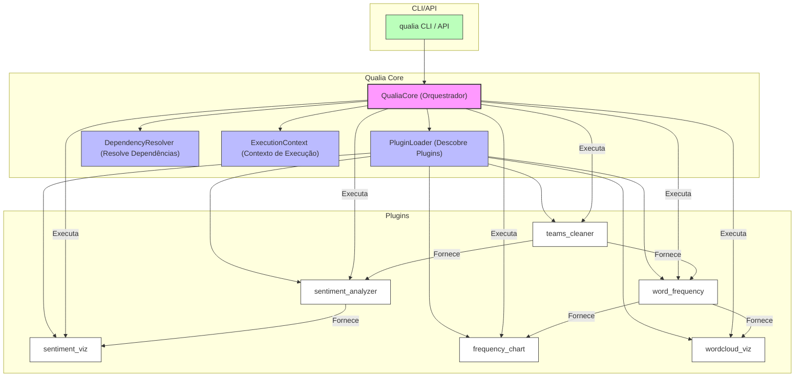

# 📚 README_COMPLEMENTAR - Qualia Core & Plugins

Este documento complementa o `README.md` principal, trazendo uma visão profunda e técnica sobre a arquitetura, funcionamento interno, exemplos de uso avançados e exposição dos códigos dos plugins do Qualia Core. O objetivo é servir tanto para usuários avançados quanto para outras IAs ou desenvolvedores que desejam entender, comparar ou evoluir os plugins existentes.

---

## 🏗️ Arquitetura Geral do Qualia Core

O Qualia Core é um framework agnóstico para análise qualitativa, baseado em uma arquitetura de **plugins auto-descritivos**. O core não implementa nenhuma análise específica, apenas orquestra plugins que se auto-descrevem via metadados.

### Fluxograma da Arquitetura



---

## 🔌 Como Funciona a Arquitetura de Plugins

- **Plugins** são módulos Python em `plugins/`, cada um com um arquivo `__init__.py`.
- Cada plugin herda de uma base (`BaseAnalyzerPlugin`, `BaseDocumentPlugin`, `BaseVisualizerPlugin`), que implementa contratos e wrappers para validação, execução e integração.
- O core descobre plugins dinamicamente, carrega metadados e resolve dependências automaticamente.
- Plugins podem ser de tipos: `analyzer`, `document`, `visualizer`, `filter`, `composer`.

### Exemplo de Metadados de Plugin
```python
class WordFrequencyAnalyzer(BaseAnalyzerPlugin):
    def meta(self) -> PluginMetadata:
        return PluginMetadata(
            id="word_frequency",
            name="Word Frequency Analyzer",
            type=PluginType.ANALYZER,
            version="1.0.0",
            description="Conta frequência de palavras com várias opções de processamento",
            provides=["word_frequencies", "vocabulary_size", "top_words", "hapax_legomena"],
            parameters={
                "min_word_length": {"type": "integer", "default": 3},
                # ... outros parâmetros ...
            }
        )
```

---

## 🧩 Plugins Disponíveis e Suas Funções

### 1. `sentiment_analyzer`
- **Tipo:** Analyzer
- **Função:** Analisa sentimento (polaridade e subjetividade) de textos em PT/EN usando TextBlob.
- **Principais Saídas:**
  - `polarity` (-1 a 1)
  - `subjectivity` (0 a 1)
  - `sentiment_label` (negativo/neutro/positivo)
  - `sentence_sentiments` (lista por sentença)
- **Exemplo de Uso (Python):**
```python
from qualia.core import QualiaCore
core = QualiaCore()
doc = core.add_document("exemplo", "Texto de teste.")
result = core.execute_plugin("sentiment_analyzer", doc, {"analyze_sentences": True})
print(result["sentiment_label"])
```
- **Exemplo de Uso (CLI):**
```bash
qualia analyze texto.txt -p sentiment_analyzer -P analyze_sentences=true
```
- **Trecho de Código Interno:**
```python
def _analyze_impl(self, document, config, context):
    blob = self.TextBlob(document.content)
    polarity = blob.sentiment.polarity
    subjectivity = blob.sentiment.subjectivity
    sentiment_label = self._get_sentiment_label(polarity, config['polarity_threshold'])
    return {
        'polarity': round(polarity, 4),
        'subjectivity': round(subjectivity, 4),
        'sentiment_label': sentiment_label,
        # ...
    }
```

---

### 2. `word_frequency`
- **Tipo:** Analyzer
- **Função:** Conta frequência de palavras, suporta stopwords, tokenização customizada, análise por segmento/speaker.
- **Principais Saídas:**
  - `word_frequencies`, `vocabulary_size`, `top_words`, `hapax_legomena`
- **Exemplo de Uso (Python):**
```python
result = core.execute_plugin("word_frequency", doc, {"min_word_length": 4})
print(result["top_words"])
```
- **Exemplo de Uso (CLI):**
```bash
qualia analyze texto.txt -p word_frequency -P min_word_length=4
```
- **Trecho de Código Interno:**
```python
def _analyze_impl(self, document, config, context):
    text = document.content.lower()
    words = self._tokenize(text, config['tokenization'])
    words = self._filter_words(words, config)
    word_freq = Counter(words)
    return {
        "word_frequencies": dict(word_freq.most_common(config['max_words'])),
        # ...
    }
```

---

### 3. `teams_cleaner`
- **Tipo:** Document
- **Função:** Limpa e estrutura transcrições do Microsoft Teams, remove ruídos, normaliza nomes, gera variantes.
- **Principais Saídas:**
  - `cleaned_document`, `document_variants`, `speakers`, `quality_report`
- **Exemplo de Uso (Python):**
```python
result = core.execute_plugin("teams_cleaner", doc, {"remove_system_messages": True})
print(result["cleaned_document"])
```
- **Exemplo de Uso (CLI):**
```bash
qualia process transcript.txt -p teams_cleaner --save-as cleaned.txt
```
- **Trecho de Código Interno:**
```python
def _process_impl(self, document, config, context):
    lines = document.content.split('\n')
    utterances = self._extract_utterances(lines, config)
    utterances = self._clean_utterances(utterances, config)
    cleaned_text = self._format_utterances(utterances, config)
    return {
        "cleaned_document": cleaned_text,
        # ...
    }
```

---

### 4. `sentiment_viz`
- **Tipo:** Visualizer
- **Função:** Gera visualizações (gauge, pizza, timeline) para resultados de sentimento.
- **Principais Parâmetros:**
  - `chart_type`, `color_scheme`, `show_examples`
- **Exemplo de Uso (CLI):**
```bash
qualia visualize sentiment.json -p sentiment_viz -P chart_type=dashboard
```
- **Trecho de Código Interno:**
```python
def _render_impl(self, data, config, output_path):
    if config['chart_type'] == 'dashboard':
        return self._render_dashboard(data, config, output_path)
    # ...
```

---

### 5. `frequency_chart`
- **Tipo:** Visualizer
- **Função:** Gera gráficos de barras, linhas ou área a partir de frequências.
- **Principais Parâmetros:**
  - `chart_type`, `max_items`, `color_scheme`, `format`, `interactive`
- **Exemplo de Uso (CLI):**
```bash
qualia visualize freq.json -p frequency_chart -P chart_type=bar -P format=html
```

---

### 6. `wordcloud_viz`
- **Tipo:** Visualizer
- **Função:** Gera nuvens de palavras a partir de frequências.
- **Principais Parâmetros:**
  - `max_words`, `colormap`, `background_color`, `format`, `font_family`
- **Exemplo de Uso (CLI):**
```bash
qualia visualize freq.json -p wordcloud_viz -P colormap=plasma -o cloud.png
```

---

## ⚙️ Como Plugins São Descobertos e Executados

- O core usa o `PluginLoader` para buscar todos os subdiretórios de `plugins/` que tenham `__init__.py`.
- Cada plugin deve implementar uma classe que herda de uma das bases e expor um método `meta()` com metadados.
- O core resolve dependências automaticamente antes de executar um plugin.
- A execução pode ser feita via CLI, API REST ou Python puro.

### Exemplo de Execução de Pipeline (YAML)
```yaml
# configs/pipelines/full_visual.yaml
steps:
  - plugin: teams_cleaner
    config:
      remove_system_messages: true
  - plugin: word_frequency
    config:
      min_word_length: 4
  - plugin: wordcloud_viz
    config:
      colormap: plasma
```

```bash
qualia pipeline meu_arquivo.txt -c configs/pipelines/full_visual.yaml -o output/
```

---

## 🛠️ Instalação e Customização

- Instale dependências com:
```bash
pip install -r requirements.txt
pip install -e .
```
- Plugins podem ser customizados editando ou criando novos diretórios em `plugins/`.
- Para adicionar um novo plugin, basta criar um novo diretório com `__init__.py` e implementar a classe base.

---

## 🧠 Observações Técnicas e Dicas para Evolução

- **Proteção automática:** Plugins podem ser protegidos com circuit breaker usando as bases de `qualia.core.protected_bases`.
- **Validação de parâmetros:** Use o método `validate_config` para garantir robustez.
- **Testes:** Cada plugin pode ser testado standalone rodando `python plugins/<nome>/__init__.py`.
- **Extensibilidade:** O core não precisa ser alterado para novos plugins, basta seguir o contrato.

---

## 📑 Conclusão

Este documento expõe a lógica, arquitetura e exemplos de uso dos plugins do Qualia Core, facilitando a comparação, evolução e integração por outros desenvolvedores ou IAs. Para detalhes de cada plugin, consulte o código-fonte em `plugins/<nome>/__init__.py` ou utilize os exemplos acima.

---

*Gerado automaticamente para documentação técnica e onboarding de times e IAs.* 